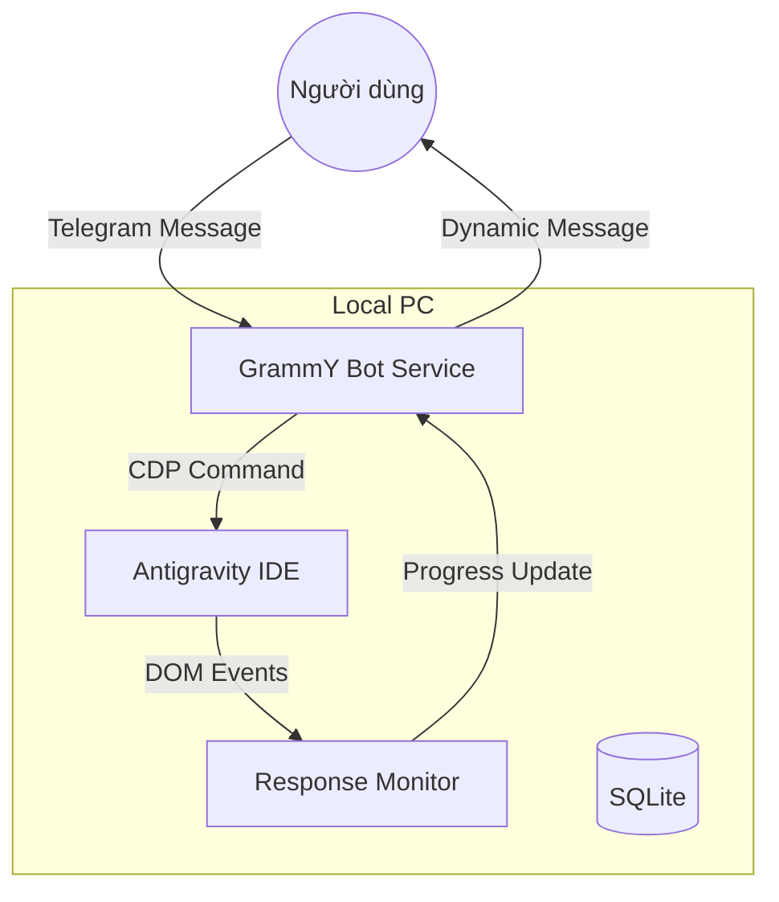

# 🚀 Remoat (Antigravity Telegram Remote)

<p align="center">
  <pre>
    ___     _   _  _____  ___  ____  ___     _  _ 
   / _ \   | \ | ||_   _||_ _||  _ \|_ _|   | \/ |
  / /_\ \  |  \| |  | |   | | | |_) || |    |    |
 / /   \ \ | |\  |  | |   | | |  _ < | |    | || |
/_/     \_\|_| \_|  |_|  |___||_| \_\|___|  |_||_|

           QUAN NGUYEN - TNM
  </pre>
  <strong>Điều khiển trợ lý lập trình AI của bạn từ bất cứ đâu — ngay từ Telegram.</strong>
</p>

<p align="center">
  <a href="https://github.com/hongquandev/antigravity-telegram-remote/blob/main/LICENSE"></a>
  
  
  
</p>

---

**Antirlm** (Antigravity-Telegram-Remote) là một **Telegram Bot cục bộ** mạnh mẽ, cho phép bạn điều khiển từ xa IDE [Antigravity](https://antigravity.dev) trên PC — từ điện thoại, máy tính bảng hoặc bất cứ thiết bị nào có Telegram.

Chỉ cần gõ hướng dẫn bằng ngôn ngữ tự nhiên, đính kèm ảnh chụp màn hình hoặc gửi ghi âm giọng nói. Remoat sẽ chuyển tiếp đến Antigravity qua Chrome DevTools Protocol (CDP), giám sát tiến trình thực tế theo thời gian thực và phản hồi kết quả trực tiếp về Telegram. **Tất cả dữ liệu và mã nguồn đều nằm an toàn trên máy của bạn.**

## 🌟 Tính năng nổi bật

*   **🕹️ Điều khiển từ xa 24/7:** Gửi lời nhắc (prompt), hình ảnh hoặc voice message từ bất cứ đâu. Antigravity sẽ thực thi trên PC của bạn với đầy đủ tài nguyên cục bộ.
*   **📂 Quản lý dự án thông minh:** Mỗi dự án được ánh xạ tới một **Telegram Forum Topic**. Mọi tin nhắn trong topic tự động đồng bộ ngữ cảnh dự án và lịch sử phiên làm việc.
*   **⏱️ Theo dõi tiến độ trực tiếp:** Tác vụ chạy dài sẽ báo cáo trạng thái theo từng giai đoạn (Suy nghĩ, Chỉnh sửa file, Chạy lệnh...) với bộ đếm thời gian thực.
*   **🎙️ Hỗ trợ Giọng nói (Local Whisper):** Ghi âm và gửi. Remoat dịch giọng nói ngay trên máy bạn qua [whisper.cpp](https://github.com/ggerganov/whisper.cpp) — không cần API đám mây, bảo mật tuyệt đối.
*   **✅ Phê duyệt từ xa:** Khi Antigravity yêu cầu xác nhận (sửa file, kế hoạch...), bạn sẽ nhận được thông báo kèm nút bấm ngay trong Telegram. Hoặc dùng `/autoaccept` để bot tự phê duyệt.
*   **⚡ Tối ưu Event-Driven:** Sử dụng `MutationObserver` và `CDP Binding` để phát hiện thay đổi DOM tức thì (<100ms). Tin nhắn Telegram được cập nhật mượt mà và tiết kiệm tài nguyên CPU vượt trội.
*   **🛡️ Bảo mật nâng cao (Security Audited):** Đã kiểm định và vá các lỗ hổng Path Traversal bằng giải thuật `realpath` (chống bypass qua symlinks). Toàn bộ dữ liệu nằm cục bộ, không có nguy cơ lộ lọt mã nguồn.
*   **🔒 Whitelist & Isolation:** Chỉ User ID được phép mới có quyền truy cập. Mỗi dự án được cách ly hoàn toàn trong các Forum Topic riêng biệt.

## 🛠️ Cài đặt nhanh (Quick Start)

### Yêu cầu hệ thống
*   [Node.js](https://nodejs.org/) 18.x trở lên.
*   [Antigravity](https://antigravity.dev) đã được cài đặt.
*   Một bot Telegram (tạo qua [@BotFather](https://t.me/BotFather)).

> [!NOTE]
> **macOS User:** Bạn cần cài đặt Xcode Command Line Tools (`xcode-select --install`) để biên dịch `better-sqlite3`.

### 1. Cài đặt Remoat
```bash
npm install -g antigravity-telegram-remote
```

### 2. Thiết lập (Setup Wizard)
Chạy lệnh sau và làm theo hướng dẫn để nhập Token Bot, User ID của bạn và thư mục Workspace:
```bash
antigravity-telegram-remote setup
```

### 3. Khởi động Antigravity với CDP
Remoat cần Antigravity chạy ở chế độ debug (CDP):
```bash
antigravity-telegram-remote open
```

### 4. Bắt đầu Bot (Trong terminal mới)
```bash
antigravity-telegram-remote start
```

> [!TIP]
> Nếu gặp bất cứ lỗi nào, hãy chạy `antigravity-telegram-remote doctor` để tự động chẩn đoán môi trường.

## ⌨️ Các lệnh điều khiển

### Lệnh CLI (Terminal)

| Lệnh | Mô tả |
| :--- | :--- |
| `antigravity-telegram-remote setup` | Chạy trình hướng dẫn thiết lập tương tác. |
| `antigravity-telegram-remote open` | Mở Antigravity với cổng CDP (9222...). |
| `antigravity-telegram-remote start` | Khởi động Telegram Bot. |
| `antigravity-telegram-remote doctor` | Kiểm tra sức khỏe hệ thống và kết nối. |
| `antigravity-telegram-remote --verbose`| Xem log chi tiết (CDP traffic, events). |

### Lệnh Telegram (Bot Chat)

| Lệnh | Chức năng |
| :--- | :--- |
| `/project` | Xem danh sách dự án trong Workspace. |
| `/status` | Kiểm tra trạng thái kết nối, dự án & mode hiện tại. |
| `/screenshot` | Chụp màn hình IDE Antigravity ngay lập tức. |
| `/model [tên]` | Đổi Model AI (ví dụ: `gemini-2.5-pro`, `claude-3.5-sonnet`). |
| `/mode` | Chuyển đổi chế độ `Fast` (nhanh) hoặc `Plan` (lập kế hoạch). |
| `/stop` | Dừng khẩn cấp tác vụ đang thực thi. |
| `/autoaccept` | Bật/tắt tự động phê duyệt chỉnh sửa file. |
| `/template` | Quản lý các mẫu prompt soạn sẵn. |
| `/cleanup` | Xóa các topic phiên làm việc cũ (>7 ngày). |
| `/help` | Xem danh sách đầy đủ các lệnh. |

## 🏗️ Kiến trúc hệ thống



Chi tiết về cấu trúc thư mục:
*   `src/services/`: Trái tim của hệ thống (CDP Bridge, DOM Extractor, Progress Monitoring).
*   `src/bot/`: Xử lý logic và định tuyến tin nhắn Telegram.
*   `src/database/`: Lưu trữ phiên làm việc, mẫu prompt qua SQLite.
*   `locales/`: Đa ngôn ngữ (Tiếng Việt, Anh, Nhật).

## 🤝 Đóng góp (Contributing)

Chúng tôi luôn hoan nghênh các đóng góp từ cộng đồng!
1. Fork repository.
2. Tạo branch mới: `git checkout -b feature/amazing-feature`.
3. Commit thay đổi: `git commit -m 'Add some amazing feature'`.
4. Push lên branch: `git push origin feature/amazing-feature`.
5. Mở một Pull Request.

Xem thêm tại [CONTRIBUTING.md](CONTRIBUTING.md).

## 📄 Giấy phép

Phát hành dưới giấy phép [MIT](LICENSE).

---
<p align="center">
  Dựa trên kiến trúc <strong>Remoat</strong> bởi <a href="https://github.com/optimistengineer">optimistengineer</a>.<br>
  Đã được tối ưu và tùy chỉnh bởi <strong>Quan Nguyen - TNM</strong>.
</p>