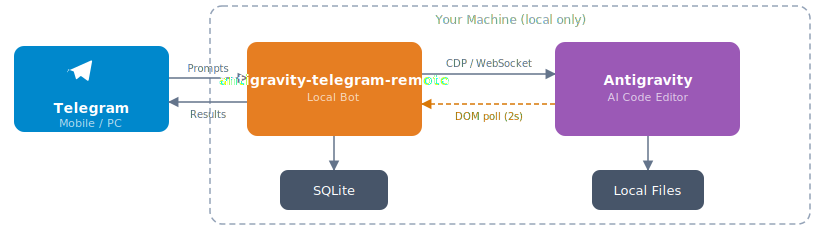

<p align="center" style="margin-bottom:0">
  
</p>
<h1 align="center" style="margin-top:0">Antigravity Telegram Remote</h1>

<p align="center">
  <strong>Điều khiển trợ lý lập trình AI của bạn từ bất cứ đâu — ngay từ Telegram.</strong>
</p>

<p align="center">
  <a href="https://github.com/optimistengineer/remoat/blob/main/LICENSE"></a>
  
  
</p>

---

antigravity-telegram-remote là một **bot Telegram cục bộ** cho phép bạn điều khiển từ xa IDE [Antigravity](https://antigravity.dev) trên PC của bạn — từ điện thoại, máy tính bảng hoặc bất cứ thiết bị nào có Telegram.

Gõ một hướng dẫn bằng ngôn ngữ tự nhiên, đính kèm ảnh chụp màn hình hoặc gửi ghi âm giọng nói. antigravity-telegram-remote gửi nó đến Antigravity qua Chrome DevTools Protocol, giám sát tiến độ thực tế và phát lại kết quả cho Telegram. Mọi thứ chạy trên máy của bạn.

## Mục lục

- [Khởi động nhanh](#khởi-động-nhanh)
- [Tính năng](#tính-năng)
- [Cài đặt nâng cao](#cài-đặt-nâng-cao)
- [Lệnh](#lệnh)
- [Khắc phục sự cố](#khắc-phục-sự-cố)
- [Cách hoạt động](#cách-hoạt-động)
- [Cấu trúc dự án](#cấu-trúc-dự-án)
- [Đóng góp](#đóng-góp)
- [Giấy phép](#giấy-phép)

## Khởi động nhanh

### Yêu cầu

- [Node.js](https://nodejs.org/) 18 trở lên
- [Antigravity](https://antigravity.dev) được cài đặt trên máy của bạn
- Tài khoản [Telegram](https://telegram.org/)

<details>
<summary>macOS: bạn cũng sẽ cần Xcode Command Line Tools</summary>

Antigravity Telegram Remote sử dụng `better-sqlite3`, một mô-đun C++ gốc yêu cầu trình biên dịch. Nếu bạn chưa cài đặt công cụ Xcode CLI, hãy chạy:

```bash
xcode-select --install
```

Bạn có thể xác minh chúng được cài đặt bằng `xcode-select -p`.

</details>

### 1. Cài đặt Antigravity Telegram Remote

```bash
npm install -g antigravity-telegram-remote
```

### 2. Chạy trình hướng dẫn cài đặt

```bash
antigravity-telegram-remote setup
```

Trình hướng dẫn sẽ hướng dẫn bạn:

- **Token Bot Telegram** — Tạo bot qua [@BotFather](https://t.me/BotFather) trên Telegram (`/newbot`), sau đó sao chép token nó cấp cho bạn
- **ID người dùng Telegram được phép** — Chỉ những người dùng Telegram này mới có thể điều khiển bot. Nhắn tin [@userinfobot](https://t.me/userinfobot) để lấy ID của bạn
- **Thư mục Workspace** — Thư mục cha nơi các dự án lập trình của bạn sống (ví dụ: `~/Code`)

### 3. Khởi động Antigravity với CDP được bật

```bash
antigravity-telegram-remote open
```

> [!NOTE]
> Nếu Antigravity đã đang chạy, hãy thoát trước rồi khởi động lại với `antigravity-telegram-remote open` — nó cần cổng gỡ lỗi CDP được bật.

### 4. Bắt đầu bot Telegram (trong một terminal mới)

```bash
antigravity-telegram-remote start
```

Đó là nó. Mở Telegram, tìm bot của bạn và bắt đầu gửi hướng dẫn.

<details>
<summary>Tin nhắn giọng nói (tùy chọn): cài đặt mô hình Whisper</summary>

```bash
npx nodejs-whisper download
```

Điều này kéo `base.en` (~140 MB). Yêu cầu `cmake` (`brew install cmake` trên macOS, `apt install cmake` trên Linux).

</details>

> Gặp sự cố? Chạy `antigravity-telegram-remote doctor` để chẩn đoán cài đặt của bạn.

## Tính năng

**Điều khiển từ xa từ bất cứ đâu** — Gửi lời nhắc bằng ngôn ngữ tự nhiên, hình ảnh hoặc ghi âm giọng nói từ điện thoại của bạn. Antigravity thực thi chúng trên PC của bạn với đầy đủ tài nguyên cục bộ.

**Cô lập dự án qua Topic Telegram** — Mỗi dự án được ánh xạ tới một Topic Diễn đàn Telegram. Tất cả tin nhắn trong một topic tự động sử dụng thư mục dự án chính xác và lịch sử phiên — không cần chuyển đổi ngữ cảnh thủ công.

**Phát trực tiếp tiến độ thực tế** — Các tác vụ chạy dài báo cáo tiến độ theo giai đoạn (gửi, suy nghĩ, hoàn thành) với nhật ký quá trình trực tiếp và bộ hẹn giờ elapsed, được phát lại dưới dạng các tin nhắn Telegram.

**Đầu vào giọng nói** — Nhấn nút micro và nói. antigravity-telegram-remote phiên dịch cục bộ qua [whisper.cpp](https://github.com/ggerganov/whisper.cpp) — không có API đám mây, không cần Telegram Premium.

**Định tuyến phê duyệt** — Khi Antigravity yêu cầu xác nhận (chỉnh sửa tệp, quyết định kế hoạch), hộp thoại xuất hiện trong Telegram với các nút hành động nội tuyến. Hoặc bật `/autoaccept` để phê duyệt tự động.

**Bảo mật theo thiết kế** — Kiểm soát truy cập dựa trên danh sách trắng. Ngăn chặn duyệt qua đường dẫn. Thông tin đăng nhập lưu trữ cục bộ. Không có webhook, không có tiếp xúc cổng.

## Cài đặt nâng cao

### Từ nguồn

```bash
git clone https://github.com/hongquandev/remoat.git
cd antigravity-telegram-remote
npm install
cp .env.example .env
```

Chỉnh sửa `.env` với các giá trị của bạn:

```env
TELEGRAM_BOT_TOKEN=your_bot_token_here
ALLOWED_USER_IDS=123456789
WORKSPACE_BASE_DIR=~/Code
USE_TOPICS=true
```

> [!TIP]
> Ngoài ra, hãy chạy `npm start -- setup` để sử dụng trình hướng dẫn tương tác thay vì chỉnh sửa `.env` thủ công.

Sau đó bắt đầu bot:

```bash
npm run dev       # chế độ phát triển với tải lại tự động
# hoặc
npm start         # chạy từ nguồn
```

### Khởi động Antigravity với CDP

antigravity-telegram-remote kết nối với Antigravity qua Chrome DevTools Protocol. Khởi động Antigravity với cổng gỡ lỗi được bật:

```bash
antigravity-telegram-remote open       # tự động chọn cổng có sẵn (9222, 9223, 9333, 9444, 9555 hoặc 9666)
```

Từ nguồn, bạn cũng có thể sử dụng các tập lệnh khởi chạy được gói:

| Nền tảng | Phương pháp |
|----------|--------|
| macOS    | Nhấp đôi `start_antigravity_mac.command` (chạy `chmod +x` lần đầu tiên) |
| Windows  | Nhấp đôi `start_antigravity_win.bat` |
| Linux    | Đặt `ANTIGRAVITY_PATH=/path/to/antigravity` trong `.env`, sau đó `antigravity-telegram-remote open` |

> Khởi động Antigravity trước, sau đó bắt đầu bot. Nó kết nối tự động.

### Topic Diễn đàn (tùy chọn)

Đối với quy trình làm việc đa dự án, Antigravity Telegram Remote hỗ trợ Chủ đề Diễn đàn Telegram — mỗi dự án có chủ đề riêng.

1. Tạo một nhóm siêu Telegram và bật **Chủ đề** trong cài đặt nhóm
2. Thêm bot của bạn vào nhóm với quyền quản trị
3. Đặt `USE_TOPICS=true` trong `.env` (đây là mặc định)

Đối với cài đặt đơn giản hơn, đặt `USE_TOPICS=false` và sử dụng bot trong một chat thông thường.

## Lệnh

### CLI

```
antigravity-telegram-remote              tự động phát hiện: chạy cài đặt nếu chưa được cấu hình, nếu không hãy khởi động bot
antigravity-telegram-remote setup        trình hướng dẫn cài đặt tương tác
antigravity-telegram-remote open         khởi động Antigravity với cổng CDP được bật
antigravity-telegram-remote start        bắt đầu bot Telegram
antigravity-telegram-remote doctor       chẩn đoán vấn đề cấu hình và kết nối
antigravity-telegram-remote --verbose    hiển thị nhật ký ở mức gỡ lỗi (lưu lượng CDP, sự kiện trình phát hiện)
antigravity-telegram-remote --quiet      chỉ lỗi
```

### Telegram

| Lệnh | Mô tả |
|---------|-------------|
| `/project` | Duyệt và chọn một dự án (bàn phím nội tuyến) |
| `/new` | Bắt đầu phiên chat mới trong dự án hiện tại |
| `/chat` | Hiển thị thông tin phiên hiện tại và liệt kê tất cả các phiên |
| | |
| `/model [name]` | Chuyển mô hình LLM (ví dụ: `gemini-2.5-pro`, `claude-opus-4-6`) |
| `/mode` | Chuyển chế độ thực thi (`fast`, `plan`) |
| `/stop` | Buộc dừng tác vụ Antigravity đang chạy |
| | |
| `/template` | Liệt kê các mẫu lời nhắc đã đăng ký với các nút thực thi |
| `/template_add <name> <prompt>` | Đăng ký một mẫu lời nhắc mới |
| `/template_delete <name>` | Xóa một mẫu |
| | |
| `/screenshot` | Chụp và gửi màn hình Antigravity hiện tại |
| `/status` | Hiển thị trạng thái kết nối, dự án hoạt động và chế độ hiện tại |
| `/autoaccept` | Bật/tắt phê duyệt tự động các hộp thoại chỉnh sửa tệp |
| `/cleanup [days]` | Làm sạch các topic phiên không hoạt động (mặc định: 7 ngày) |
| `/help` | Hiển thị các lệnh có sẵn |

### Ngôn ngữ tự nhiên

Chỉ cần gõ trong bất kỳ chủ đề ràng buộc nào hoặc chat trực tiếp:

> _refactor các thành phần xác thực — xem ảnh chụp màn hình đính kèm cho bố cục mục tiêu_

Hoặc nhấn nút mic và nói — ghi âm giọng nói sẽ được phiên dịch cục bộ và gửi dưới dạng lời nhắc.

## Khắc phục sự cố

Chạy chẩn đoán trước:

```bash
antigravity-telegram-remote doctor
```

Điều này kiểm tra cấu hình của bạn, phiên bản Node.js, công cụ Xcode (macOS), cài đặt Antigravity và kết nối cổng CDP.

**`npm install` thất bại với `gyp ERR!` trên macOS** — Cài đặt Xcode Command Line Tools: `xcode-select --install`

**`antigravity-telegram-remote open` không thể tìm thấy Antigravity** — Ứng dụng phải nằm trong `/Applications`. Nếu bạn cài đặt ở nơi khác, hãy đặt `ANTIGRAVITY_PATH` trong tệp `.env` hoặc môi trường của bạn:

```bash
export ANTIGRAVITY_PATH=/path/to/Antigravity
antigravity-telegram-remote open
```

**Bot không phản hồi tin nhắn** — Hãy chắc chắn rằng Antigravity đang chạy với CDP được bật (`antigravity-telegram-remote open`) trước khi khởi động bot. Bot sẽ cảnh báo bạn khi khởi động nếu không có cổng CDP nào phản hồi, nhưng nó tiếp tục chạy và tự động kết nối một khi Antigravity khả dụng.

**Kết nối CDP bị mất** — Nếu bạn khởi động lại Antigravity, bot tự động kết nối lại. Gửi bất cứ tin nhắn nào cũng kích hoạt kết nối lại.

**Ghi nhật ký chi tiết:**

```bash
antigravity-telegram-remote --verbose      # xem lưu lượng CDP, sự kiện trình phát hiện và trạng thái nội bộ
```

## Cách hoạt động

<p align="center">
  <a href="https://excalidraw.com/#json=a54sSDUatTXGCtJORO7GJ,muz3R_zi4nbj9RKuRAfbEA">
    
  </a>
</p>

1. Bạn gửi một tin nhắn trong Telegram
2. antigravity-telegram-remote xác thực nó so với danh sách trắng của bạn, giải quyết ngữ cảnh dự án và tiêm lời nhắc vào Antigravity qua CDP
3. Trình giám sát phản hồi thăm dò DOM của Antigravity ở các khoảng thời gian 2 giây, phát hiện giai đoạn tiến độ, hộp thoại phê duyệt, lỗi và hoàn thành
4. Kết quả được phát lại cho Telegram dưới dạng các tin nhắn được định dạng

Bot không bao giờ tiếp xúc với cổng, không bao giờ chuyển tiếp lưu lượng bên ngoài và không bao giờ lưu trữ mã của bạn ở bất cứ đâu ngoài ổ đĩa cục bộ của bạn.

> Để tìm hiểu sâu hơn, hãy xem [docs/ARCHITECTURE.md](docs/ARCHITECTURE.md). Nhấp vào sơ đồ ở trên để có [phiên bản tương tác](https://excalidraw.com/#json=a54sSDUatTXGCtJORO7GJ,muz3R_zi4nbj9RKuRAfbEA).

## Cấu trúc dự án

```
src/
  bin/          điểm vào CLI (các lệnh con của Commander)
  bot/          bot grammy — xử lý sự kiện, định tuyến lệnh, truy vấn gọi lại
  commands/     trình xử lý lệnh slash Telegram và trình phân tích tin nhắn
  services/     logic kinh doanh cốt lõi (CDP, giám sát phản hồi, trình phát hiện, phiên)
  database/     kho lưu trữ SQLite (phiên, liên kết không gian làm việc, mẫu, lịch)
  middleware/   xác thực (danh sách trắng ID người dùng) và làm sạch đầu vào
  ui/           những người xây dựng InlineKeyboard Telegram
  utils/        cấu hình, ghi nhật ký, định dạng, i18n, bảo mật đường dẫn, xử lý giọng nói/hình ảnh
tests/          tệp thử nghiệm phản chiếu cấu trúc src/
docs/           tài liệu kiến trúc, tham chiếu bộ chọn DOM, sơ đồ
locales/        bản dịch i18n (en, ja, vi)
```

## Đóng góp

Các đóng góp được chào đón — dù là sửa lỗi, tính năng mới, cải tiến tài liệu hay phạm vi thử nghiệm.

```bash
git clone https://github.com/optimistengineer/remoat.git
cd antigravity-telegram-remote
npm install
cp .env.example .env  # điền vào các giá trị của bạn
npm run dev           # bắt đầu với tải lại tự động
npm test              # chạy bộ thử nghiệm
```

Xem [CONTRIBUTING.md](CONTRIBUTING.md) để biết hướng dẫn đầy đủ — kiểu mã, quy ước cam kết, quy trình PR và kiến trúc dự án.

## Lịch sử sao

[](https://www.star-history.com/#optimistengineer/remoat&type=date&legend=top-left)

## Giấy phép

[MIT](LICENSE)

## Lời cảm ơn

Dựa trên [Remoat](https://github.com/optimistengineer/remoat), bot Remote để điều khiển từ xa Antigravity qua CDP. Antigravity Telegram Remote chuyển kiến trúc cốt lõi sang Telegram và thêm các tính năng như Topic Diễn đàn, đầu vào giọng nói và trích xuất DOM được cấu trúc.
